# Projeto final do curso BI-MASTER 2020-2.
Repositório: bimaster-proj  
Autor: Alex Marques Campos
Matrícula: 202190054

## Descrição
O presente projeto tem como finalidade servir como projeto de final do curso BI-MASTER, da turma 2020-2, para o aluno Alex Marques Campos.
A proposta do projeto é realizar uma atividade de análise de anomalias em uma série história com poucas amostras, para explorar a dificuldade da análise em uma série deste tipo e as ferramentas que podem ser utilizadas para a detecção de anomalias. A hipótese é que a detecção de anomalias seria feita em um processo batch, dado que série possui uma baixa frequência, mas também exploraremos abordagens para permitir estabelecer um processo de deteção de anomalias 'stream-like'.

## Sobre a série temporal escolhida
Por ser utilizada como parte do processo de avaliação de desempenho de alguns produtos do BNDES, selecionamos a série IBC-BR para ser o foco da análise. Essa série mede o desempenho da economia do país, mês a mês. Tal índice é produzido pelo Banco Central do Brasil e está disponível no portal de dados abertos do BACEN ([IBC-BR](https://dadosabertos.bcb.gov.br/dataset/24363-indice-de-atividade-economica-do-banco-central---ibc-br)). Os dados são gerados a partir de 2003 e, em novembro de 2022, a série possuía 236 valores.

## Análise dos dados

Arquivo: [ibc-br_analise_serie.ipynb](ibc_br_analise_serie.ipynb)  
Processo de análise:
- Obtivemos os dados do __Banco Central do Brasil__, através de uma API REST, localizada em http://api.bcb.gov.br/dados/serie/bcdata.sgs.24363/dados?formato=csv.
- Verificamos propriedades básicas dos dados (quantidades, estatísticas, presença de valores nulos, etc.).
- Visualizamos os dados como um gráfico de linha.

   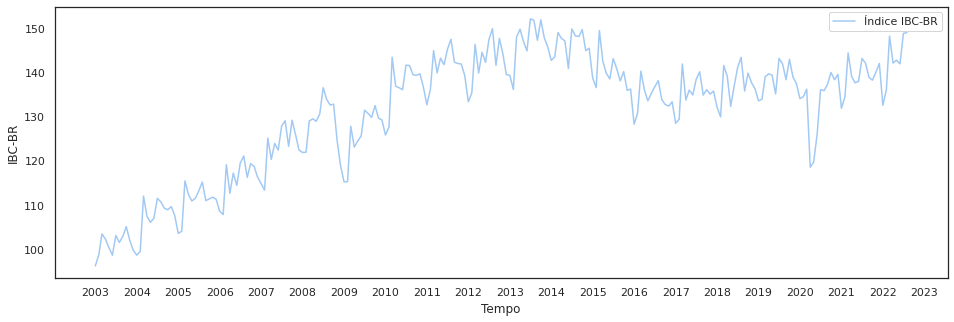
- Decompusemos os dados nos aspectos de 'tendência', 'sazonalidade' e 'resíduo'.

   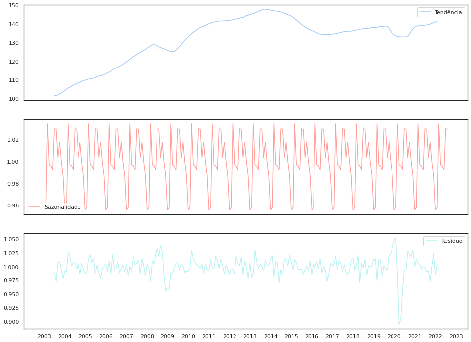
- Verificamos que a sazonalidade é bem definida (12 meses).
- Verificamos que a tendência não é linear.
- Verificamos que as anomalias parecem estar contidas no resíduo.
- Analisamos a distribuição dos dados e identificamos que a maioria deles está contida na faixa entre 120 e 140.
- Analisamos as propriedades estatísticas que definem se a série é ou não estacionária (propriedade que desejamos, para poder aplicar alguns métodos na fase de análise de anomalias) e vimos que apenas a sazonalidade e o resíduo da série IBC-BR são estacionárias.
- Como o processo de decomposição da série poderia ser um problema em uma abordagem de detecção de anomalias "stream-like" e a série IBC-BR não era estacionária, decidimos construir uma série derivada, calculando as diferenças entre valores subsequentes na série original e analisar seus resultados.
- Construímos a série de diferenças e verificamos propriedades básicas dos dados (quantidades, estatísticas, presença de valores nulos, etc.)
- Comparamos visualmente as série IBC-BR original e a série de diferenças e avaliamos que a série de diferenças captura as mudanças de comportamento da série original e que parecia estacionária, sendo um provável proxy da série original para um processo de detecção de anomalias.

   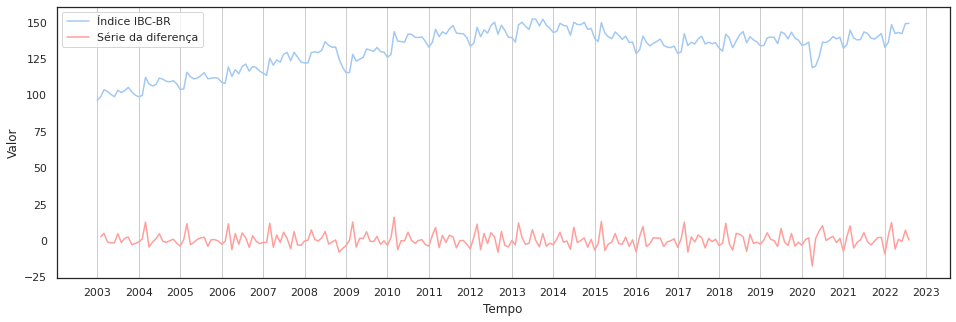
- Decompusemos a série de diferenças para analisar o comportamento das componentes de tendência, sazonalidade e resíduo de forma mais detalhada.

   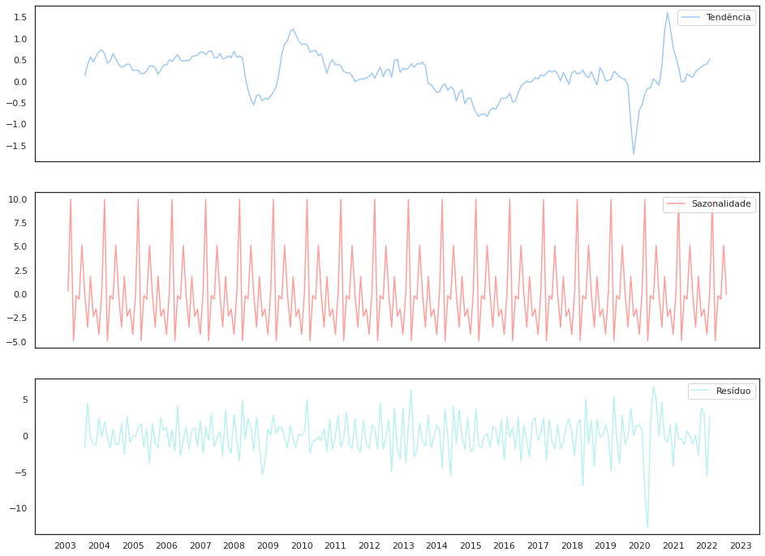
- Notamos que as duas séries, IBC-BR e de diferenças, possuíam valores residuais inválidos (NaN) em algumas posições, por isso verificamos se a quantidade e as posições desses elementos nulos eram compatíveis nas duas séries, concluímos que eram (ocorriam em índices e quantidades similares nas duas séries) e os removemos das séries, para prosseguir com a análise.
- Comparamos visualmente as duas séries residuais, da série IBC-BR e da série de diferenças, após remover os valores inválidos e normalizar os valores de ambas.

   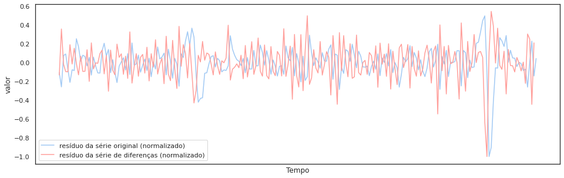
- As análises dos dados reforçaram a hipótese de que série de diferenças seria um bom proxy da série IBC-BR. 
- Também verificamos que tanto a série de diferenças quanto o resíduo da série de diferenças são séries estacionárias.
- Calculamos a média móvel com uma janela de 12 meses e desenhamos o gráfico da série e de sua média móvel para as séries IBC-BR e de diferenças, mas a média móvel, fortemente ligada à tendência, não parecia uma boa abordagem para o processo de detecção de anomalias.

   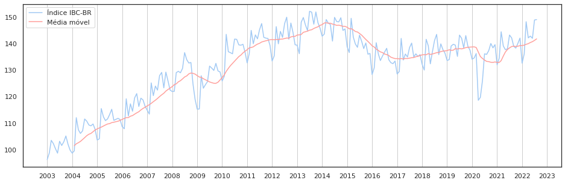

   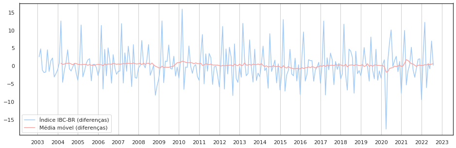
- Analisamos a autocorrelação dos valores da série IBC-BR, com lag de até 24 meses, e concluímos que:
   - Os valores da série IBC-BR são autocorrelacionados.
   - Os valores da série IBC-BR são autocorrelacionados _negativamente_ a cada 6 meses.
   - Os valores da série IBC-BR são autocorrelacionados positivamente, de maneira forte, a cada 7 meses.
   - Os valores da série IBC-BR são autocorrelacionados positivamente a cada 12 meses (nossa hipótese inicial).
   - Os valores da série IBC-BR são autocorrelacionados _negativamente_, de maneira forte, a cada 13 meses.

      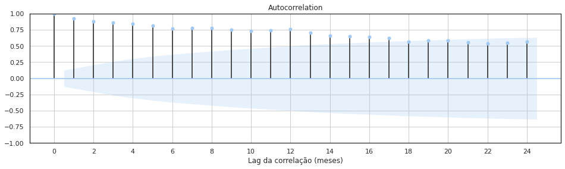

      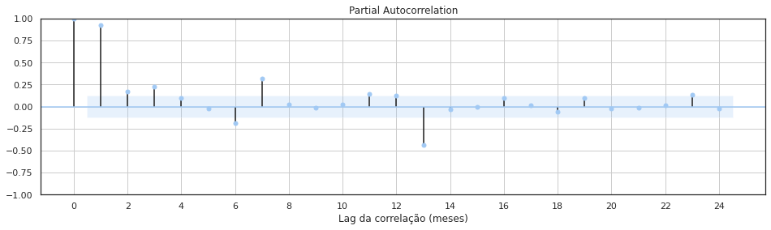
   - Os valores de sazonalidade são correlacionados positivamente a cada 12 meses (nossa hipótese).

      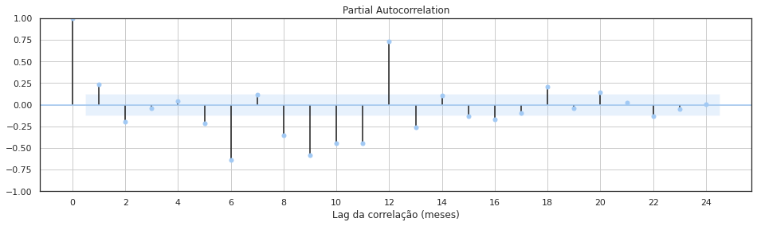
   - Os valores de tendência e resíduo da série IBC-BR não são autocorrelacionados (como esperávamos.)
- Analisamos a autocorrelação dos valores da série de diferenças da IBC-BR, com lag de até 24 meses, e concluímos que:
   - Como na série IBC-BR, os valores da série de diferenças são autocorrelacionados.
   - Como na série IBC-BR, os valores da série de diferenças são autocorrelacionados _negativamente_ a cada 6 meses.
   - Diferentemente da série IBC-BR, os valores da série de diferenças _não_ são autocorrelacionados positivamente, de maneira forte, a cada 7 meses.
   - Como na série IBC-BR, os valores da série de diferenças são autocorrelacionados positivamente a cada 12 meses.
   - Diferentemente da série IBC-BR, os valores da série de diferenças _não_ são autocorrelacionados _negativamente_, de maneira forte, a cada 13 meses.

      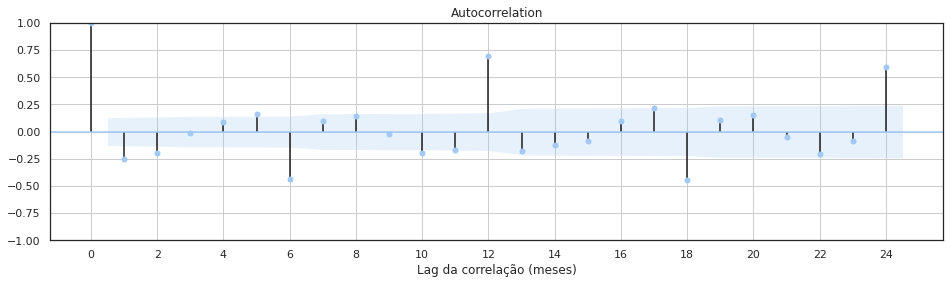

      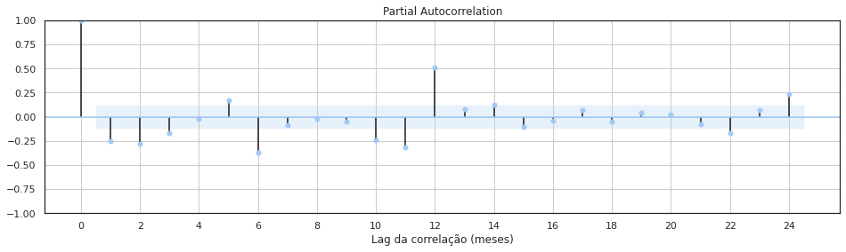
   - Os valores de resíduo da série de diferenças não são autocorrelacionados, como esperávamos.
- Não analisamos a correlação dos componentes de tendência e sazonalidade de forma isolada, pois a série de diferenças é estacionária.

## Resumo da análise
Após analisarmos a série histórica do IBC-BR, vemos que:
- A série histórica do IBC-BR está autocorrelacionada positivamente com valores com lag de doze meses.
- A série histórica do IBC-BR está autocorrelacionada negativamente com valores com lag de seis meses.
- A série histórica do IBC-BR não é estacionária.
- A tendência da série histórica do IBC-BR não é linear.
- Aparentemente, as anomalias da série histórica do IBC-BR podem ser encontradas no resíduo da série, após sua decomposição.
- Uma nova série histórica pode ser derivada da série IBC-BR fazendo a diferença de valores consecutivos da série original (doravante chamaremos esta série de "série de diferenças").
- A série de diferenças é estacionária.
- Aparentemente, as anomalias da série original ainda podem ser encontradas na série de diferenças.
- Como a série de diferenças também é estacionária, esta poderá ser analisada por métodos estatísticos para tentarmos identificar as anomalias nos dados.
- A construção da série de diferenças nos permite fazer a deteção de anomalias sem ter que decompor a série que se quer testar. Isso é importante para simplificar um eventual sistema de deteção de anomalias que emule um comportamento de análise de streaming.

## Persistência

Ao final do processo de análise dos dados, persistimos as séries de interesse em quatro arquivos:

1. [serie_ibcbr.csv](dados/serie_ibcbr.csv) : dados da série IBC-BR.
2. [serie_ibcbr_residuo.csv](dados/serie_ibcbr_residuo.csv) : dados do componente de resíduos da série IBC-BR.
3. [serie_ibcbr_diferencas.csv](dados/serie_ibcbr_diferencas.csv) : dados da série de diferenças.
4. [serie_ibcbr_diferencas_residuo.csv](dados/serie_ibcbr_diferencas_residuo.csv) : dados do componente de resíduos da série de diferenças.

Os dados foram persistidos sem os valores inválidos (NaN), e com o nome do índice e da coluna valorada padronizados como "data" e "valor", respectivamente. Esses dados serão usados na próxima etapa, de detecção de anomalias.

## Detecção de Anomalias

### Via métodos estatísticos

Arquivo: [ibc_br_da_metodos_estatisticos.ipynb](ibc_br_da_metodos_estatisticos.ipynb)

Para o processo de análise estatística dos dados, analisamos os seguintes dados:
* [Série IBC-BR](dados/serie_ibcbr.csv).
* [Resíduos da série IBC-BR](dados/serie_ibcbr_residuo.csv).
* [Série de diferenças](dados/serie_ibcbr_diferencas.csv).
* [Resíduos da série de diferenças](dados/serie_ibcbr_diferencas_residuo.csv).

Iniciamos o processo carregando e verificando os dados de cada uma das séries temporais.

#### Método: _z-score_ modificado

O seguinte processo foi seguido para realizar a detecção de anomalias com o método _z-score_ modificado.

1. Calculamos o z-score modificado de cada entrada dos resíduos da série IBC-BR.
2. Analisamos os dados de z-score modificado obtidos para as entradas.
3. Filtramos os dados dos resíduos da série IBC-BR de forma que restassem apenas os que possuíam z-score modificado maior ou menor que 2.5 unidades de MAD (sigla em inglês para o desvio absoluto mediano).

      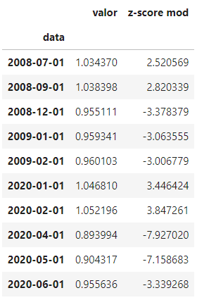
      
      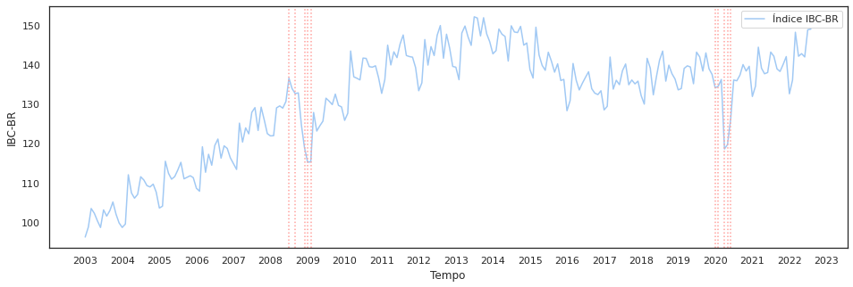
      
      O processo detectou anomalias em 2008 e 2009 (potenciais efeitos da crise do mercado financeiro mundial de 2008) e também encontrou anomalias entre dezembro de 2019 até junho de 2020 (potenciais efeitos da pandemia de COVID-19).
4. Calculamos o z-score modificado de cada entrada da série de diferenças.
5. Analisamos os dados de z-score modificado obtidos para as entradas.
6. Filtramos os dados da série de diferenças de forma que restassem apenas os que possuíam z-score modificado maior ou menor que 2.5 unidades de MAD.

      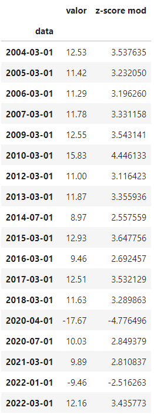
      
      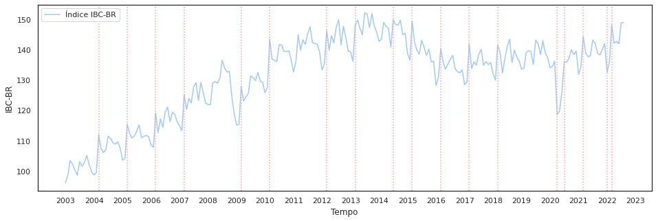
7. Filtramos os dados da série de diferenças de forma que restassem apenas os que possuíam z-score modificado maior ou menor que 3.5 unidades de MAD.

      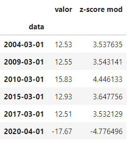
      
      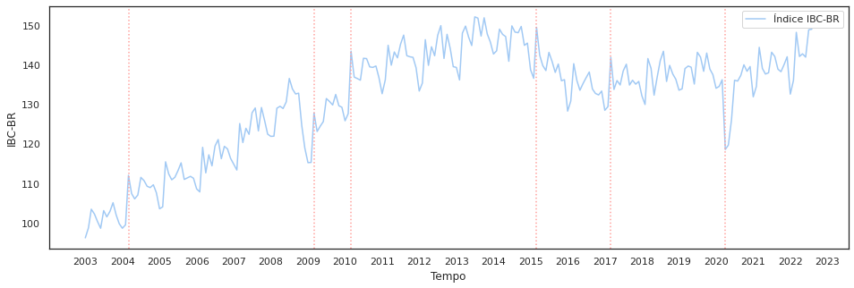

      As anomalias encontradas analisando apenas a série de diferenças são muito diferentes das anomalias que entendemos existirem nos dados. Verificamos que os valores das diferenças, apesar de serem uma série estacionária, ainda carregam em si a modulação da tendência e da sazonalidade e isso influencia grandemente a série. 
      
      Avaliamos que a detecção de anomalias em uma série de diferenças é útil para detectar grandes variações entre valores consecutivos da série, mas não apresentou um desempenho bom para detectar anomalias no escopo semântico da série (momentos em que a série se comportou de maneira inesperada com relação à sua proposta), quando comparamos os resultados obtidos com o z-score modificado.

#### Método: CUMSUM (somas cumulativas)

O seguinte processo foi seguido para realizar a detecção de anomalias com o método CUMSUM.

1. Calculamos as somas altas e as somas baixas da série de resíduos da série IBC-BR, usando o método CUMSUM, com um limiar inicial de 2.5 unidades.
2. Analisamos o resultado e readequamos o limiar para 0.8 unidades.
3. Obtivemos o conjunto de anomalias com o limiar de 0.8 unidades.

      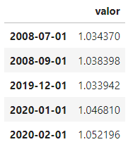

      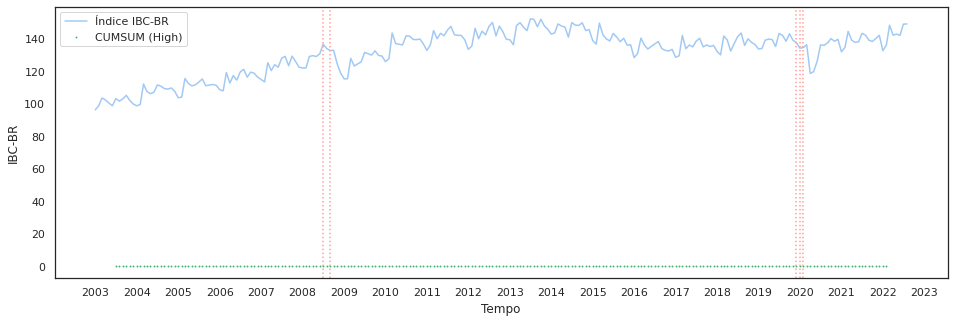

      A série de diferenças não foi analisada via o método CUMSUM, pois a análise via o método _z-score_ modificado revelou que os dados nela contidos não apresentavam as anomalias nas quais estávamos interessados.

      Das cinco anomalias encontradas via o método CUMSUM com limiar 0.8, quatro delas também foram detectadas pelo método z-score modificado, que encontrou um total de 10 anomalias com limiar 2.5 unidades.  

### Via predição de séries

Arquivo: [ibc_br_da_predicao_de_series.ipynb](ibc_br_da_predicao_de_series.ipynb)
FIXME: continuar daqui.

## Conclusão

