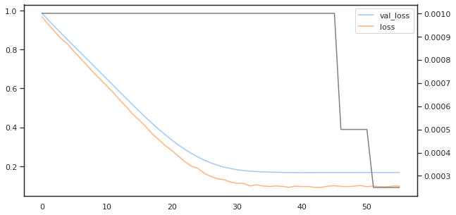
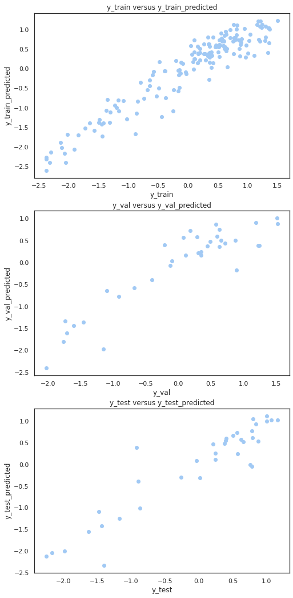
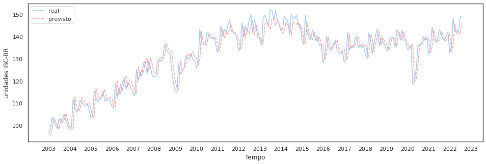
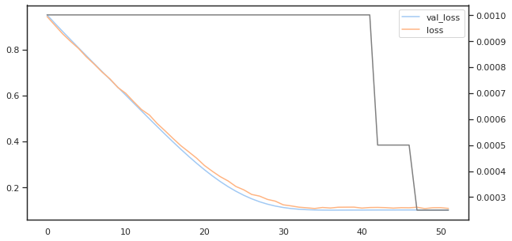
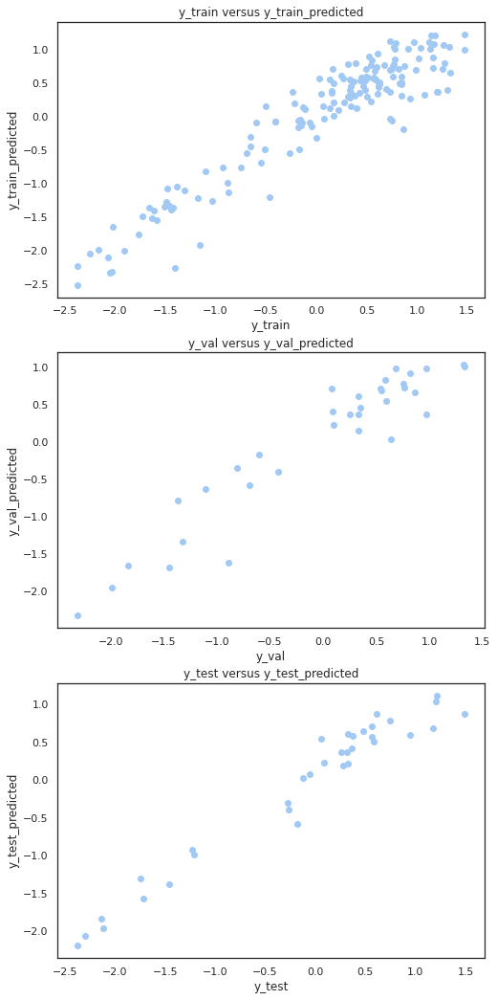
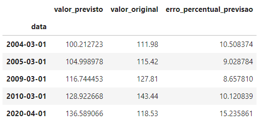
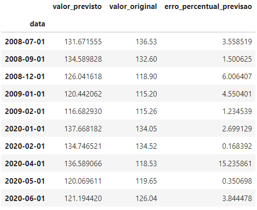

# Projeto Final ('PROJ') - BI MASTER 2020.2
## Detecção de Anomalias em Série Temporal
Repositório: bimaster-proj  
Autor: Alex Marques Campos  
Matrícula: 202190054

## Descrição
Este projeto visa realizar a atividade de detecção de anomalias em uma série temporal com poucas amostras, visando explorar a dificuldade de trabalhar com uma série deste tipo e algumas das ferramentas que podem ser utilizadas neste cenário. A hipótese é que a detecção de anomalias seja feita em um processo _batch_, mas também exploraremos abordagens para permitir estabelecer um processo de deteção de anomalias '_stream-like_'.

Este é o projeto final do curso de pós-graduação 'BI MASTER', turma 2020.2, do aluno Alex Marques Campos.

## Sobre a série temporal escolhida
Por ser utilizada como parte do processo de avaliação de desempenho de alguns produtos do BNDES, selecionamos a série IBC-BR para ser o foco da análise. Essa série mede o desempenho da economia do país, mês a mês. Tal índice é produzido pelo Banco Central do Brasil e está disponível no portal de dados abertos do BACEN ([IBC-BR](https://dadosabertos.bcb.gov.br/dataset/24363-indice-de-atividade-economica-do-banco-central---ibc-br)). Os dados são gerados a partir de 2003 e, em novembro de 2022, a série possuía 236 valores.

## Análise dos dados

Arquivo: [ibc-br_analise_serie.ipynb](ibc_br_analise_serie.ipynb)  
Processo de análise:
- Obtivemos os dados do __Banco Central do Brasil__, através de uma API REST, localizada em http://api.bcb.gov.br/dados/serie/bcdata.sgs.24363/dados?formato=csv.
- Verificamos propriedades básicas dos dados (quantidades, estatísticas, presença de valores nulos, etc.).
- Visualizamos os dados como um gráfico de linha.

   
- Decompusemos os dados nos aspectos de 'tendência', 'sazonalidade' e 'resíduo'.

   
- Verificamos que a sazonalidade é bem definida (12 meses).
- Verificamos que a tendência não é linear.
- Verificamos que as anomalias parecem estar contidas no resíduo.
- Analisamos a distribuição dos dados e identificamos que a maioria deles está contida na faixa entre 120 e 140.
- Analisamos as propriedades estatísticas que definem se a série é ou não estacionária (propriedade que desejamos, para poder aplicar alguns métodos na fase de análise de anomalias) e vimos que apenas a sazonalidade e o resíduo da série IBC-BR são estacionárias.
- Como o processo de decomposição da série poderia ser um problema em uma abordagem de detecção de anomalias '_stream-like_' e a série IBC-BR não era estacionária, decidimos construir uma série derivada, calculando as diferenças entre valores subsequentes na série original e analisar seus resultados.
- Construímos a série de diferenças e verificamos propriedades básicas dos dados (quantidades, estatísticas, presença de valores nulos, etc.)
- Comparamos visualmente as série IBC-BR original e a série de diferenças e avaliamos que a série de diferenças captura as mudanças de comportamento da série original e que parecia estacionária, sendo um provável proxy da série original para um processo de detecção de anomalias.

   
- Decompusemos a série de diferenças para analisar o comportamento das componentes de tendência, sazonalidade e resíduo de forma mais detalhada.

   
- Notamos que as duas séries, IBC-BR e de diferenças, possuíam valores residuais inválidos (NaN) em algumas posições, por isso verificamos se a quantidade e as posições desses elementos nulos eram compatíveis nas duas séries, concluímos que eram (ocorriam em índices e quantidades similares nas duas séries) e os removemos das séries, para prosseguir com a análise.
- Comparamos visualmente as duas séries residuais, da série IBC-BR e da série de diferenças, após remover os valores inválidos e normalizar os valores de ambas.

   
- As análises dos dados reforçaram a hipótese de que série de diferenças seria um bom proxy da série IBC-BR. 
- Também verificamos que tanto a série de diferenças quanto o resíduo da série de diferenças são séries estacionárias.
- Calculamos a média móvel com uma janela de 12 meses e desenhamos o gráfico da série e de sua média móvel para as séries IBC-BR e de diferenças, mas a média móvel, fortemente ligada à tendência, não parecia uma boa abordagem para o processo de detecção de anomalias.

   

   
- Analisamos a autocorrelação dos valores da série IBC-BR, com lag de até 24 meses, e concluímos que:
   - Os valores da série IBC-BR são autocorrelacionados.
   - Os valores da série IBC-BR são autocorrelacionados _negativamente_ a cada 6 meses.
   - Os valores da série IBC-BR são autocorrelacionados positivamente, de maneira forte, a cada 7 meses.
   - Os valores da série IBC-BR são autocorrelacionados positivamente a cada 12 meses (nossa hipótese inicial).
   - Os valores da série IBC-BR são autocorrelacionados _negativamente_, de maneira forte, a cada 13 meses.

      

      
   - Os valores de sazonalidade são correlacionados positivamente a cada 12 meses (nossa hipótese).

      
   - Os valores de tendência e resíduo da série IBC-BR não são autocorrelacionados (como esperávamos.)
- Analisamos a autocorrelação dos valores da série de diferenças da IBC-BR, com lag de até 24 meses, e concluímos que:
   - Como na série IBC-BR, os valores da série de diferenças são autocorrelacionados.
   - Como na série IBC-BR, os valores da série de diferenças são autocorrelacionados _negativamente_ a cada 6 meses.
   - Diferentemente da série IBC-BR, os valores da série de diferenças _não_ são autocorrelacionados positivamente, de maneira forte, a cada 7 meses.
   - Como na série IBC-BR, os valores da série de diferenças são autocorrelacionados positivamente a cada 12 meses.
   - Diferentemente da série IBC-BR, os valores da série de diferenças _não_ são autocorrelacionados _negativamente_, de maneira forte, a cada 13 meses.

      

      
   - Os valores de resíduo da série de diferenças não são autocorrelacionados, como esperávamos.
- Não analisamos a correlação dos componentes de tendência e sazonalidade de forma isolada, pois a série de diferenças é estacionária.

## Resumo da análise
Após analisarmos a série histórica do IBC-BR, vemos que:
- A série histórica do IBC-BR está autocorrelacionada positivamente com valores com lag de doze meses.
- A série histórica do IBC-BR está autocorrelacionada negativamente com valores com lag de seis meses.
- A série histórica do IBC-BR não é estacionária.
- A tendência da série histórica do IBC-BR não é linear.
- Aparentemente, as anomalias da série histórica do IBC-BR podem ser encontradas no resíduo da série, após sua decomposição.
- Uma nova série histórica pode ser derivada da série IBC-BR fazendo a diferença de valores consecutivos da série original (doravante chamaremos esta série de 'série de diferenças').
- A série de diferenças é estacionária.
- Aparentemente, as anomalias da série original ainda podem ser encontradas na série de diferenças.
- Como a série de diferenças também é estacionária, esta poderá ser analisada por métodos estatísticos para tentarmos identificar as anomalias nos dados.
- A construção da série de diferenças nos permite fazer a deteção de anomalias sem ter que decompor a série que se quer testar. Isso é importante para simplificar um eventual sistema de deteção de anomalias que emule um comportamento de análise de streaming.

## Persistência

Ao final do processo de análise dos dados, persistimos as séries de interesse em quatro arquivos:

1. [serie_ibcbr.csv](dados/serie_ibcbr.csv) : dados da série IBC-BR.
2. [serie_ibcbr_residuo.csv](dados/serie_ibcbr_residuo.csv) : dados do componente de resíduos da série IBC-BR.
3. [serie_ibcbr_diferencas.csv](dados/serie_ibcbr_diferencas.csv) : dados da série de diferenças.
4. [serie_ibcbr_diferencas_residuo.csv](dados/serie_ibcbr_diferencas_residuo.csv) : dados do componente de resíduos da série de diferenças.

Os dados foram persistidos sem os valores inválidos (NaN), e com o nome do índice e da coluna valorada padronizados como 'data' e 'valor', respectivamente. Esses dados serão usados na próxima etapa, de detecção de anomalias.

## Detecção de Anomalias

### Via métodos estatísticos

Arquivo: [ibc_br_da_metodos_estatisticos.ipynb](ibc_br_da_metodos_estatisticos.ipynb)

Para o processo de análise estatística dos dados, analisamos os seguintes dados:
* [Série IBC-BR](dados/serie_ibcbr.csv).
* [Resíduos da série IBC-BR](dados/serie_ibcbr_residuo.csv).
* [Série de diferenças](dados/serie_ibcbr_diferencas.csv).
* [Resíduos da série de diferenças](dados/serie_ibcbr_diferencas_residuo.csv).

Iniciamos o processo carregando e verificando os dados de cada uma das séries temporais.

#### Método: _z-score_ modificado

O seguinte processo foi seguido para realizar a detecção de anomalias com o método _z-score_ modificado.

1. Calculamos o _z-score_ modificado de cada entrada dos resíduos da __série IBC-BR__.
2. Analisamos os dados de _z-score_ modificado obtidos para as entradas da __série IBC-BR__.
3. Filtramos os dados dos resíduos da __série IBC-BR__ de forma que restassem apenas os que possuíam _z-score_ modificado maior ou menor que 2.5 unidades de MAD (sigla em inglês para o desvio absoluto mediano).

      
      
      
      
      O processo detectou anomalias em 2008 e 2009 (potenciais efeitos da crise do mercado financeiro mundial de 2008) e também encontrou anomalias entre dezembro de 2019 até junho de 2020 (potenciais efeitos da pandemia de COVID-19).
4. Para compararmos os resultados com outra abordagem, calculamos o _z-score_ modificado de cada entrada da __série de diferenças__.
5. Analisamos os dados de _z-score_ modificado obtidos para as entradas da __série de diferenças__.
6. Filtramos os dados da __série de diferenças__ de forma que restassem apenas os que possuíam _z-score_ modificado maior ou menor que 2.5 unidades de MAD.

      
      
      
7. Para entender melhor as anomalias encontradas, filtramos os dados da __série de diferenças__ de forma que restassem apenas os que possuíam _z-score_ modificado maior ou menor que 3.5 unidades de MAD, de forma que menos anomalias fossem indicadas.

      
      
      

      As anomalias encontradas analisando apenas a série de diferenças são muito diferentes das anomalias que entendemos existirem nos dados. Verificamos que a série de diferenças, apesar de ser uma série estacionária, ainda carrega em si a modulação da sazonalidade e isso é refletido nas em grandes diferenças entre valores consecutivos, o que influencia o processo de detecção de anomalias. 
      
      Avaliamos que o processo de detecção de anomalias na série de diferenças é útil para detectar grandes variações entre valores consecutivos da série, mas não se mostrou tão útil para detectar anomalias no escopo semântico da série (momentos em que a série se comportou de maneira inesperada com relação à sua proposta), quando comparamos os resultados obtidos com o _z-score_ modificado na série de resíduos.

#### Método: CUMSUM (somas cumulativas)

O seguinte processo foi seguido para realizar a detecção de anomalias com o método CUMSUM.

1. Calculamos as somas altas e as somas baixas da __série de resíduos da série IBC-BR__, usando o método CUMSUM, com um limiar inicial de 2.5 unidades.
2. Analisamos o resultado e readequamos o limiar para 0.8 unidades para as somas altas e baixas.
3. Obtivemos o conjunto de anomalias com o limiar de 0.8 unidades para as somas altas e baixas.

      

      

      A série de diferenças não foi analisada via o método CUMSUM, pois a análise desta série via o método _z-score_ modificado revelou que os dados nela contidos não apresentavam as anomalias nas quais estávamos interessados.

      Das cinco anomalias encontradas via o método CUMSUM com limiar 0.8, quatro delas também foram detectadas pelo método _z-score_ modificado, que encontrou um total de 10 anomalias com limiar 2.5 unidades.  

### Via predição de séries com o modelo LSTM

Arquivo: [ibc_br_da_predicao_de_series.ipynb](ibc_br_da_predicao_de_series.ipynb)

Nesta seção, apresentamos uma abordagem diferente para a detecção de anomalias em séries temporais, através do uso de um modelo de inteligência artificial para realizar a predição de valores da série temporal. O racional é que um modelo treinado com dados regulares da série temporal (valores que não representem anomalias) prediria valores regulares para momentos onde anomalias ocorressem nos dados reais. Quando um valor anômalo ocorresse na série, o modelo treinado prediria um valor contendo um erro muito grande quando comparássemos o valor previsto e o valor real - isso seria o indicativo que uma anomalia ocorreu nos dados reais.

O modelo proposto para esse processo é uma rede neural com camadas LSTM (_Long Short Term Memory_), uma arquitetura de rede neural recorrente (RNN, do _inglês recurrent neural network_) que _costuma_ apresentar bom desempenho em tarefas de predição de séries temporais.

A primeira parte do processo, descrita abaixo, tinha como objetivo calibrar os parâmetros do modelo (principalmente a topologia da rede) e outros aspectos de treinamento, como o tamanho da segregação em batch, o número de épocas necessária etc. Também acabamos explorando diferentes tamanhos das janelas deslizantes.

#### Processo da primeira fase: encontrando e calibrando parâmetros da entrada, do modelo e do treinamento

1. Carregamos e verificamos os dados da [série IBC-BR](dados/serie_ibcbr.csv).
2. Normalizamos os valores, para evitar que o modelo fosse enviesado por grandes valores absolutos (mas também fizemos testes com os dados originais, sem estarem normalizados).
3. Separamos os dados em conjuntos, usando janelas deslizantes e também um valor alvo, o imediatamente após o final da janela - este é o valor a ser previsto pelo modelo.
4. Separamos os dados em conjuntos de treinamento, validação e testes.
5. Criamos um modelo LSTM e o treinamos usando os dados de treinamento, validação e testes.

      

      Durante o treinamento, monitoramos o desempenho das predições realizadas pelo modelo frente ao conjunto de validação e ajustamos automaticamente a taxa de aprendizado, para refinar o treinamento. O processo também foi interrompido antes do final do total de épocas quando foi detectado que o erro calculado estabilizou. A métrica utilizada para calcular o erro da função objetivo foi o MSE (_mean squared error_).

6. Verificamos, pelo histórico de treinamento se houve ou não __overtraining__.
7. Analisamos a relação entre os valores previstos e os valores reais para os conjuntos de treinamento, validação e testes.

      

      Nessa análise, os pontos pareciam bastante próximos à reta $x = y$, o que era o esperado.

8. Calculamos e avaliamos o erro encontrado no modelo usando as métricas MSE (_mean squared error_, que também foi usada para nortear o treinamento), RMSE (_root mean squared error_), MAPE (_Mean Absolute Percentual Error_), $R^2$ _score_ e $R^2$ _score_ ajustado.

|     Métrica de Erro | Treino |  Validação  | Teste  |
|---------------------|--------|-------------|--------|
|                 MSE |   0.09 |        0.17 |   0.14 |
|                RMSE |   0.31 |        0.41 |   0.38 |
|                MAPE |  0.64% |       0.67% |  0.92% |
|            R2 Score |   0.90 |        0.83 |   0.87 |
| R2 Score (ajustado) |   0.90 |        0.83 |   0.86 |

9. Comparamos a curva dos dados reais da __série IBC-BR__ versus a curva de valores previstos pelo modelo LSTM.

      

Aqui cabe um comentário sobre os diferentes parâmetros que foram avaliados no processo exploratório:

   * __Normalização__: Testamos o MinMaxScaler, do sklearn, implementamos um normalizador personalizado, que chamamos de StandardScaler, e também testamos o processo sem normalizar os dados. No final, foi mantido o uso do StandardScaler para normalizar os dados.
   * __Janela deslizante__ dos dados de entrada: Testamos janelas deslizantes de 24 (chute inicial do que seria uma janela adequada), 36, 48, 60, 7, 6, 3, 2 e 1. Incrivelmente, a janela com os melhores resultados foi a de 1 unidade.
   * __Topologia__ da rede neural: 
      * Sempre utilizamos uma camada de _dropout_ após as camadas LSTM ou _dense_ (exceto a camada _dense_ final), para deixar o modelo mais resiliente, mas também testamos topologias com uma camada LSTM, com uma camada LSTM e uma camada _dense_ adicional (totalmente conectada) e com duas camadas LSTM e uma camada _dense_ adicional. A topologia que gerou melhores resultados foi a com uma camada LSTM (seguida de camada de _dropout_) e da camada _dense_ final, mas sem camadas intermediárias adicionais.
      * Variamos o número de unidades nas camadas LSTM e _dense_ intermediárias entre 1, 2, 4, 8, 12, 24, 36, 60, 100, 120, 240. A quantidade de unidades que gerou melhores resultados foram 120 unidades.
      * Variamos o _dropout_ entre 10% e 20% e mantivemos o uso de 20% de _dropout_.
   * __Treinamento__:
      * Variamos o otimizador entre o SGD (_stochastic gradient descent_) e o Adam (uma variante do SGD) e optamos pelo uso do Adam.
      * Variamos o tamanho do _batch_ (quantidade de entradas apresentadas ao modelo em uma dada iteração do treinamento) entre o conjunto total, 200, 100 e 50. Avaliamos que o uso de um _batch_ com tamanho 50 apresentou melhores resultados, por isso foi o utilizado.
      * Avaliamos o uso de conjunto de validação entre 5%, 10%, 15% e 20% do total de entradas disponíveis. Escolhemos a proporção de 15%.
      * Avaliamos o uso de conjunto de teste entre 5%, 10%, 15% e 20% do total de entradas disponíveis. Escolhemos a proporção de 15%.
      * Avaliamos quantidades de épocas entre 100, 200, 300, 400, 600 e 800. Escolhemos 800 como o número de épocas adequado (principalmente porque estávamos utilizando o callback EarlyStopping do Keras e avaliando situação de _overtraining_ no resultado do treinamento).
      * Avaliamos diversos parâmetros dos callbacks de treinamento Keras ReduceLROnPlateau e EarlyStopping, principalmente os critérios que detectam a estabilidade nos dados de treinamento.

A maior parte do esforço foi aplicado nessa primeira fase e a percepção foi que a pequena quantidade de dados de entrada acabou sendo um grande limitador no processo de treinamento do modelo de IA. Talvez fosse possível obter resultados melhores caso houvesse mais dados disponíveis.

#### Processo da segunda fase: Encontrando anomalias nos dados

Após encontrar um tamanho de janela deslizante adequado, de definir a topologia e os parâmetros do modelo e do treinamento, estávamos prontos para treinar um novo modelo que fosse capaz de encontrar anomalias nos dados, para isso seguimos o processo descrito abaixo:

1. Obtivemos os índices das anomalias encontradas via o uso do _z-score_ modificado na __série de resíduos da série IBC-BR__, pois esse método foi o que apresentou o melhor desempenho até então.
2. Criamos uma cópia dos dados da __série IBC-BR__ e removemos da série todas as anomalias listadas no passo (1), de forma que o conjunto de entrada só contivesse dados regulares.
3. Normalizamos os valores da série criada em (2) utilizando o normalizador personalizado que escrevemos, chamado StandardScaler.
4. Separamos os dados da série em conjuntos de treinamento, validação (15%) e teste (15%) utilizando uma janela deslizante de tamanho 1.
5. Criamos um modelo com a topologia escolhida (uma camada LSTM de 120 unidades com _dropout_ de 20% e utilizando o otimizador Adam).
6. Treinamos o modelo com um _batch_ de 50 elementos por 800 épocas (mas nos fazendo valer do callback de parada antecipada do treinamento).  
      
7. Verificamos, pelo histórico de treinamento se houve ou não __overtraining__.
8. Analisamos a relação entre os valores previstos e os valores reais para os conjuntos de treinamento, validação e testes.

      

      Nessa análise, os pontos pareciam bastante próximos à reta $x = y$, o que era o esperado.

8. Calculamos e avaliamos o erro encontrado no modelo usando as métricas MSE (_mean squared error_, que também foi usada para nortear o treinamento), RMSE (_root mean squared error_), MAPE (_Mean Absolute Percentual Error_), $R^2$ _score_ e $R^2$ _score_ ajustado.

|     Métrica de Erro | Treino |  Validação  | Teste  |
|---------------------|--------|-------------|--------|
|                 MSE |   0.11 |        0.10 |   0.06 |
|                RMSE |   0.33 |        0.32 |   0.25 |
|                MAPE |  1.86% |       0.67% |  0.66% |
|            R2 Score |   0.88 |        0.90 |   0.95 |
| R2 Score (ajustado) |   0.88 |        0.89 |   0.95 |

9. Utilizamos o modelo treinado para fazer previsões de valores para a __série IBC-BR__ (original) e calculamos a diferença percentual absoluta entre o valor real e o valor previsto, ponderado pelo valor real. Esse valor será usado para detectar as anomalias.
10. Excluímos dos dados originais os dados que representam a primeira janela deslizante, pois não há previsão para estes.
11. Verificamos a distribuição do erro percentual nos dados previstos.

|Propriedade|Valor     |
|-----------|----------|
|  __count__|235.000000|
|  __mean__ |  2.616567|
|  __std__  |  2.334002|
|  __min__  |  0.003477|
|  __25%__  |  0.911211|
|  __50%__  |  2.126614|
|  __75%__  |  3.600360|
|  __max__  | 15.235861|

12. Calculamos o quantil de 98% do erro percentual dos dados (8.5355%), com a premissa de que 2% dos dados seriam anomalias (mas poderíamos ter usado o valor de 4%, pois o _z-score_ modificado encontrou 10 anomalias em 236 entradas).
13. Filtramos os resultados (valores reais e previstos) onde o erro percentual absoluto ponderado pelo valor real era maior do que o limiar definido (quantil de 98%) e encontramos o que seriam 5 anomalias nos dados.

      

14. Comparamos as previsões feitas pelo modelo LSTM e os respectivos erros percentuais, para os valores contidos nos índices identificados pelo __z-score__ modificado.

      

      De todas as anomalias identificadas, apenas a entrada ocorrida em 2020-04-01 também ocorre nas anomalias identificadas pelo método do _z-score_ modificado. Também vemos que, mesmo se considerássemos o valor do quantil de 75% do erro percentual para detectar as anomalias (o que seria bastante agressivo), apenas 4 das 10 anomalias identificadas pelo _z-score_ modificado seriam encontradas (valores que possuem um erro percentual absoluto ponderado maior que 3.600360%).

## Conclusão

No presente trabalho, utilizamos diversos métodos para realizar a detecção de anomalias em séries temporais, a saber: _z-score_ modificado, CUMSUM (soma cumulativa) e predição de séries via modelo de inteligência artificial LSTM. Em especial, utilizamos uma série temporal com poucas amostras e cuja tendência é não linear - estes aspectos foram fatores de dificuldade adicionais. 

Para alcançar o objetivo pretendido, realizamos a análise dos dados da série e seu tratamento. Criamos uma série derivada, da diferença dos elementos consecutivos da série, para superar a dificuldade da série original não ser estacionária (requisito para alguns dos métodos). Também decompusemos a série original e tentatamos detectar as anomalias em seu resíduo (o que não é parte da tendência nem da sazonalidade). Tivemos bastante sucesso com os métodos de detecção de anomalias, mas o uso da série de diferenças não se mostrou promissor ao tipo de anomalia que procurávamos.

Os métodos estatísticos (_z-score_ modificado e CUMSUM) são os de mais fácil aplicação, apesar da necessidade de que a série original seja decomposta primeiro, para que se obtenha o resíduo da série. O modelo de inteligência artificial LSTM foi o mais complexo de ser utilizado para que se pudesse obter resultados adequados.

Para séries com poucas amostras, todos os métodos são adequados tanto para o processamento _online_ quanto para processamento em _batch_. Para séries com muitas amostras, os métodos estatísticos continuam adequados para o processamento _online_ ou em _batch_, mas o método de predição de série temporal pode apresentar dificuldades para uso em processamento _online_, dependendo da frequência e dos custos computacionais envolvidos no treinamento do modelo.

De todos os métodos, um se destacou em nossa avaliação: o **_z-score_ modificado aplicado no resíduo da série IBC-BR** foi o que apresentou os melhores resultados na detecção de anomalias e a melhor relação de custo/benefício em sua aplicação para esse objetivo.

Talvez o método de predição de série temporal apresentasse resultados melhores com um maior volume de dados de entrada, com uma topologia ligeiramente diferente ou até com o uso de outro modelo para a predição. Deixamos essa avaliação para um trabalho subsequente.
